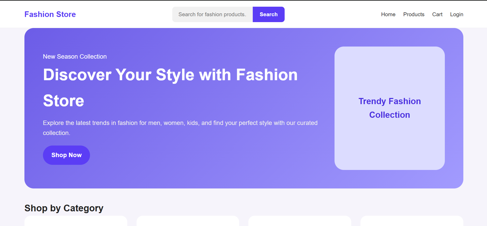
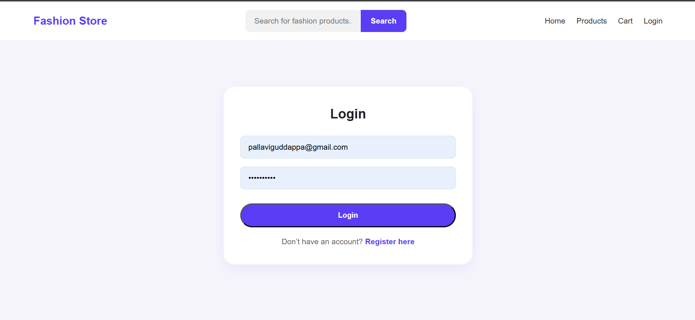
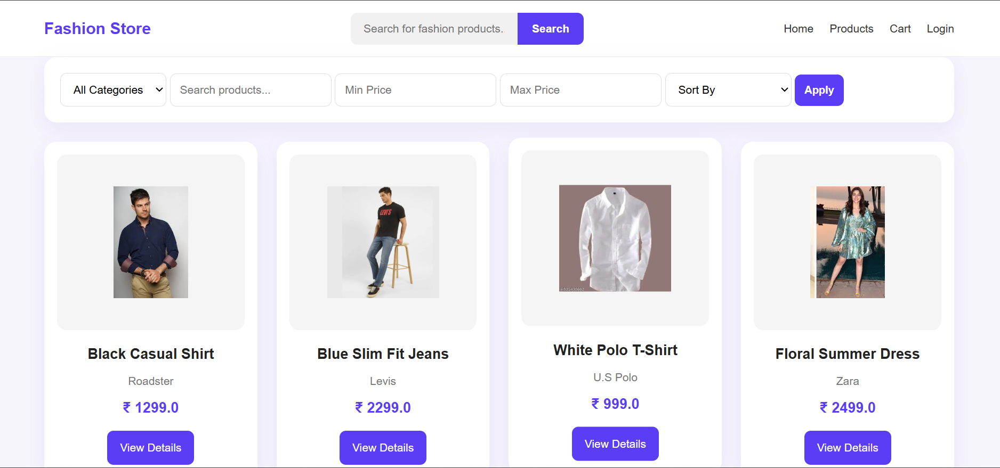
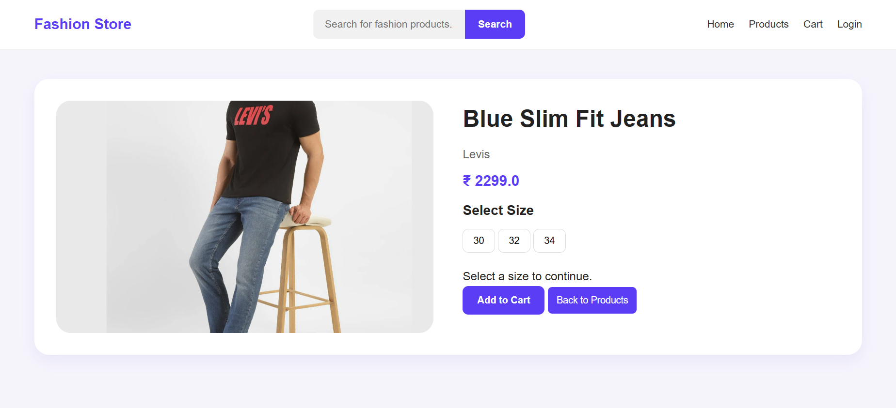
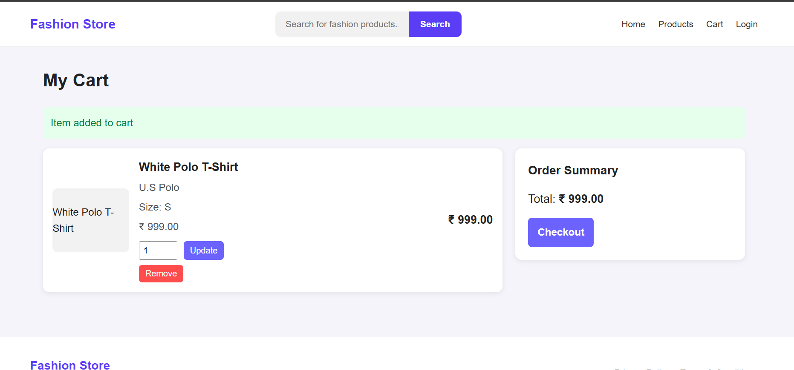
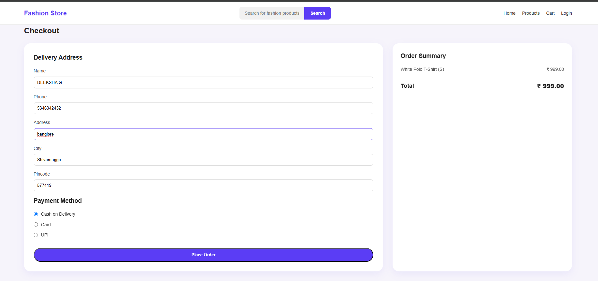

# Fashion Store E-Commerce Web Application

## Project Description

This is a Java Full Stack E-Commerce Fashion Store application developed to provide users with an online shopping experience. Users can browse products, view product details, add products to the cart, and place orders efficiently.

## Technologies Used

- Core Java
- Advanced Java
- Servlets
- JSP
- JDBC
- MySQL
- HTML
- CSS
- Apache Tomcat
- Maven

## Features

- User Registration and Login
- Product Catalog
- Product Details
- Add to Cart
- Checkout
- Order Confirmation
- Session Management
- Database Connectivity

## Architecture

MVC Architecture

## Database

MySQL

## Screenshots

### Home Page

### Login Page

### Products Page

### Product Details Page

### Cart Page

### Checkout Page

### Order Confirmation Page

## Author

Deeksha G
